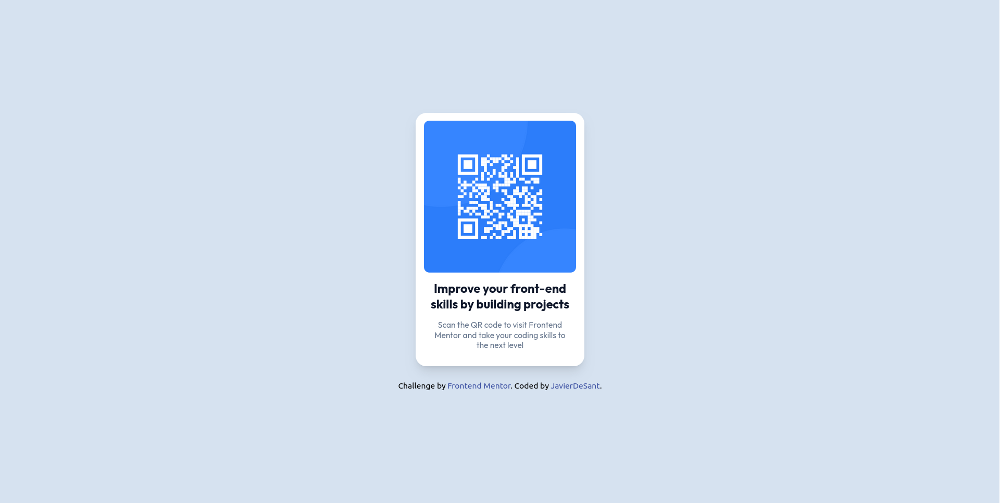

# Frontend Mentor - QR code component solution

This is a solution to the [QR code component challenge on Frontend Mentor](https://www.frontendmentor.io/challenges/qr-code-component-iux_sIO_H). Frontend Mentor challenges help you improve your coding skills by building realistic projects. 

## Table of contents

- [Overview](#overview)
  - [Screenshot](#screenshot)
  - [Links](#links)
  - [Built with](#built-with)
- [Author](#author)

## Overview

### Screenshot

### Links

- Solution URL: [QR code component using React and Tailwind CSS](https://www.frontendmentor.io/solutions/qr-code-component-using-react-and-tailwind-css-49iW7rBVD9)
- Live Site URL: (https://qrcode-javierdesant.netlify.app/)

### Built with

- CSS custom properties
- Flexbox
- CSS Grid
- [React](https://reactjs.org/) - JS library
- [Tailwind CSS](https://styled-components.com/) - For styles

## Author

- Github - [JavierDeSant](https://github.com/javierdesant)
- Frontend Mentor - [@javierdesant](https://www.frontendmentor.io/profile/javierdesant)